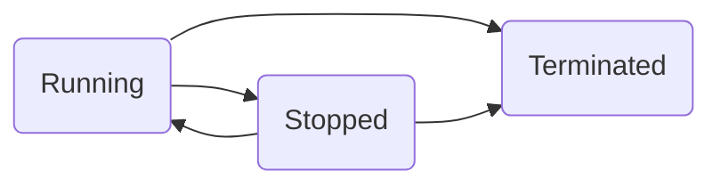

# Elastic Compute Cloud (EC2)

It is an [[IAAS]] (Infrastructure as a service) provides [[Virtual Machine]] or Instances.

Private service by-default, uses VPC Networking.

An EC2 instance is in a subnet, a subnet is in an [[Availability Zone]] --> EC2 is AZ resilient --> an instance fails if AZ fails.

At a momemt, an instance is one of those states:
- Running
- Stopped
- Terminated: this is not revertable, it will delete all the comsumed resources related to the instance.
- Transition states: Stopping, Shutting down, Pending.

EC2 is a on-demand billing service, and it is calculated by per second, per hour. It is charged by what you consume: CPU, Memory, Storage, Network.

Consuming table

|   State    | CPU | Memory | Network | Storage |
| ---------- | --- | ------ | ------- | ------- |
| Running    | Yes | Yes    | Yes     | Yes     |
| Stopped    | No  | No     | No      | Yes     |
| Terminated | No  | No     | No      | No      |

You connect to EC2 Windows instances using [[Remote Desktop Protocol]] (RDP) through port **3389**, or to Linux instances using SSH through port **22**. Private key can be downloaded one and only one time.